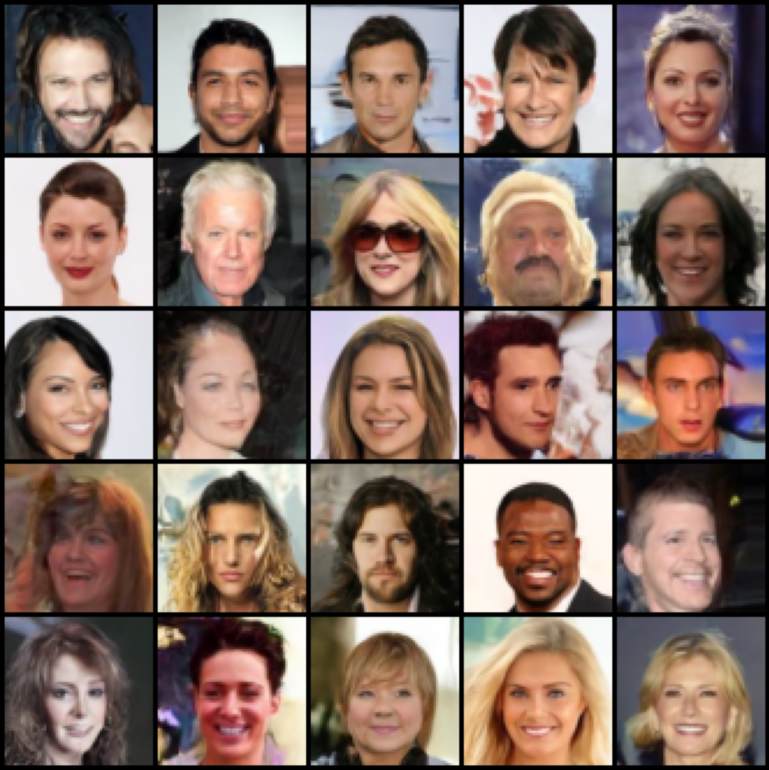

# ddpm-pytorch

PyTorch reproduction of [**Denoising Diffusion Probabilistic Models**](https://arxiv.org/pdf/2006.11239) (Ho et al., 2020).



## Overview

This repo implements a PyTorch reproduction of Ho et al. (2020), training a U-Net to reverse a fixed Markovian noising process by predicting the noise added at each diffusion step across T=1000 timesteps.

**Key components:**
- Linear β noise schedule (β_1 = 0.0001 → β_T = 0.02, T = 1000)
- U-Net denoiser with sinusoidal time embeddings, ResNet blocks, and multi-head self-attention
- MSE loss on predicted noise ε
- OneCycleLR scheduler, AdamW optimizer, gradient clipping

## Architecture

The denoising network is a U-Net (`ddpm.py`) with the following structure:

```
Input (3×64×64)
    → conv_in (3→64)
    → Encoder
        DownBlock1: 64→64, no attn, downsample (64×64 → 32×32)
        DownBlock2: 64→128, no attn, downsample (32×32 → 16×16)
        DownBlock3: 128→256, self-attn, downsample (16×16 → 8×8)
        DownBlock4: 256→512, self-attn, no downsample
    → MiddleBlock: 512→512, self-attn (8×8 bottleneck)
    → Decoder
        UpBlock1: 512→512, self-attn, no upsample
        UpBlock2: 512→256, self-attn, upsample (8×8 → 16×16)
        UpBlock3: 256→128, no attn, upsample (16×16 → 32×32)
        UpBlock4: 128→64, no attn, upsample (32×32 → 64×64)
    → conv_out (64→3)
Output (3×64×64) - predicted noise ε̂
```

Each DownBlock and UpBlock contains two ResNet blocks with additive time conditioning. Skip connections are passed from encoder to decoder at each resolution. Attention uses `F.scaled_dot_product_attention`.

Time conditioning uses sinusoidal embeddings projected through a two-layer MLP with SiLU activations.

## Setup

```bash
git clone https://github.com/342tanmay/ddpm-pytorch
cd ddpm-pytorch
pip install torch torchvision tqdm matplotlib
```

CelebA will be auto downloaded via `torchvision.datasets.CelebA` on first run.

## Training

```bash
python ddpm_training.py
```

Default config: 50 epochs, batch size 64, lr 1e-4, images center-cropped to 178×178 then resized to 64×64. Checkpoints and sample grids are saved every 5 epochs.

To modify hyperparameters, edit the `__main__` block in `ddpm_training.py`.

## Inference

```bash
python ddpm_inference.py
```

Loads `ddpm_celeba_epoch50.pt` and generates a 5×5 grid of samples via the full 1000 step reverse diffusion process, saved to `CelebA_Samples.png`.

## Results

Samples above are from the epoch 50 checkpoint after training on CelebA 64×64. The model generates globally coherent faces with plausible hair, skin tone, and facial structure. Some artifacts remain at fine detail (teeth, backgrounds) which is expected at this resolution and training duration.

## File Structure

```
ddpm-pytorch/
├── CelebA_Samples.png
├── README.md
├── dataloaders.py
├── ddpm.py
├── ddpm_inference.py
├── ddpm_training.py
└── noise_scheduler.py
```

## Reference

> Ho, J., Jain, A., & Abbeel, P. (2020). *Denoising Diffusion Probabilistic Models*. NeurIPS 2020. [arXiv:2006.11239](https://arxiv.org/abs/2006.11239)

## Citation
```bibtex
@inproceedings{ho2020denoising,
  title={Denoising Diffusion Probabilistic Models},
  author={Ho, Jonathan and Jain, Ajay and Abbeel, Pieter},
  booktitle={Advances in Neural Information Processing Systems},
  volume={33},
  pages={6840--6851},
  year={2020}
}
```